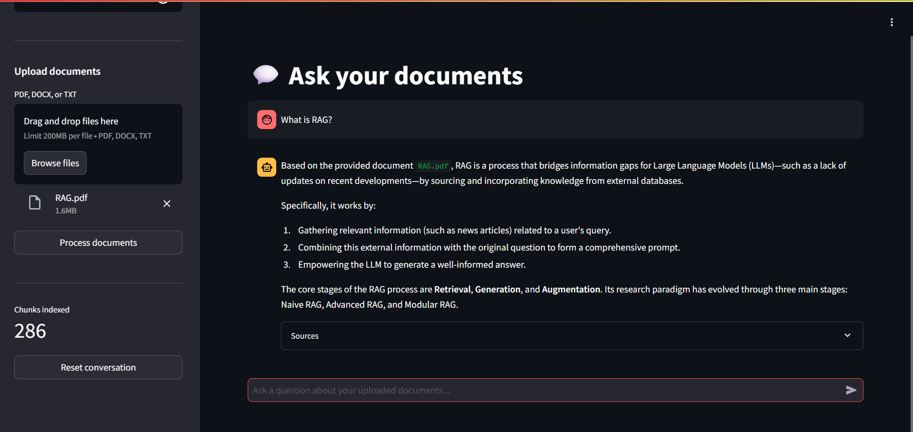

# 📚 Company Knowledge Assistant

### Enterprise Retrieval Augmented Generation (RAG) System

[](https://www.python.org/)
[](https://fastapi.tiangolo.com/)
[](https://streamlit.io/)
[](https://github.com/facebookresearch/faiss)
[](LICENSE)
[](https://ai.google.dev/)

---

## 📖 Overview

**Company Knowledge Assistant** is a production-style, modular Retrieval Augmented
Generation (RAG) application that lets you upload internal company documents
(PDF, DOCX, TXT) and ask natural-language questions about them. Answers are
generated by **Google Gemini**, grounded strictly in the content you upload,
with source citations for every response.

The project ships with:

- A reusable Python RAG engine (`src/`)
- A **FastAPI** backend for programmatic access
- A **Streamlit** chat UI for end users
- Everything generated automatically from a single **Google Colab notebook**

---

## ✨ Features

- 📄 Multi-format document upload — PDF, DOCX, TXT
- 🧹 Document parsing & cleaning
- ✂️ Custom, configurable chunking (sentence-aware, not just fixed windows)
- 🧠 Embeddings via `sentence-transformers/all-MiniLM-L6-v2`
- 🗂️ Persistent FAISS vector store (save / load / update / search)
- 🔍 Top-K retrieval with similarity scoring and thresholding
- 💬 Conversation memory with a configurable history limit
- 📌 Source citations on every answer
- 🚫 Strict "answer only from context" guardrail — no hallucinated answers
- 🌐 FastAPI REST API (`/upload`, `/chat`, `/reset`, `/health`)
- 🎨 Streamlit chat interface with sidebar upload & source viewer
- 🐳 Docker-ready
- ☁️ 100% buildable from Google Colab — no local setup required

---

## 🏗️ Architecture

```
 Documents (PDF/DOCX/TXT)
        │
        ▼
   Document Loader
        │
        ▼
  Custom Text Splitter  (chunk_size / chunk_overlap)
        │
        ▼
  Sentence-Transformer Embeddings
        │
        ▼
     FAISS Vector Store
        │
        ▼
   Top-K Retriever (+ score filtering)
        │
        ▼
    Prompt Builder  (context-grounded)
        │
        ▼
     Google Gemini (gemini-3.5-flash)
        │
        ▼
  Answer + Sources + Memory
```

---

## 📂 Folder Structure

```
company-knowledge-assistant/
├── README.md
├── requirements.txt
├── .gitignore
├── Dockerfile
├── app.py                       # CLI entry point
├── data/
│   ├── uploaded_docs/            # Uploaded source documents
│   └── vector_store/             # Persisted FAISS index + metadata
├── src/
│   ├── loader.py                  # PDF / DOCX / TXT loading
│   ├── splitter.py                # Custom sentence-aware chunking
│   ├── embeddings.py              # Sentence-Transformers wrapper
│   ├── vectorstore.py             # FAISS persistence & search
│   ├── retriever.py               # Top-K retrieval + filtering
│   ├── prompt.py                  # Context-grounded prompt template
│   ├── rag_chain.py               # Full RAG pipeline orchestration
│   ├── chat_memory.py             # Bounded conversation memory
│   └── utils.py                   # Logging, config, Gemini client
├── api/
│   └── main.py                    # FastAPI application
├── streamlit_app/
│   └── app.py                     # Streamlit chat UI
├── docs/
│   └── screenshots/                # UI screenshots for this README
└── notebooks/
    └── CompanyKnowledgeAssistant.ipynb   # The notebook that built this project
```

---

## ⚙️ Installation

### Option A — Run in Google Colab (recommended)

1. Open `notebooks/CompanyKnowledgeAssistant.ipynb` in Google Colab.
2. Run every cell top to bottom.
3. Paste your Gemini API key when prompted (or set `GEMINI_API_KEY`).
4. Upload documents and start asking questions.

### Option B — Run locally

```bash
git clone https://github.com/kunalkirtak/company-knowledge-assistant.git
cd company-knowledge-assistant
python -m venv venv
source venv/bin/activate      # Windows: venv\Scripts\activate
pip install -r requirements.txt
export GEMINI_API_KEY="your-real-api-key"   # Windows: set GEMINI_API_KEY=...
```

---

## 🚀 Running Locally

### Start the FastAPI backend

```bash
uvicorn api.main:app --reload --port 8000
```

Visit interactive docs at `http://localhost:8000/docs`.

### Start the Streamlit UI

```bash
streamlit run streamlit_app/app.py
```

### Run the CLI chatbot

```bash
python app.py --docs data/uploaded_docs/handbook.pdf
```

### Run with Docker

```bash
docker build -t company-knowledge-assistant .
docker run -p 8000:8000 -e GEMINI_API_KEY="your-real-api-key" company-knowledge-assistant
```

---

## 🔌 API Reference

| Method | Endpoint   | Description                              |
|--------|------------|--------------------------------------------|
| GET    | `/health`  | Health check + vector store size           |
| POST   | `/upload`  | Upload and index PDF/DOCX/TXT documents    |
| POST   | `/chat`    | Ask a question, get a grounded answer      |
| POST   | `/reset`   | Clear conversation memory                  |

---

## 🖼️ Screenshots

> Add UI screenshots to `docs/screenshots/` and reference them here.

| Chat UI | Source Citations |
|---------|-------------------|
|  |  |

---

## 🗺️ Future Improvements

- [ ] Hybrid search (BM25 + dense retrieval)
- [ ] Streaming Gemini responses
- [ ] Multi-user authentication & per-user vector stores
- [ ] Support for additional formats (CSV, HTML, Markdown)
- [ ] Re-ranking with a cross-encoder
- [ ] Deployment templates for Render / Railway / GCP Cloud Run

---

## 🤝 Contributing

Contributions are welcome!

1. Fork the repository
2. Create a feature branch: `git checkout -b feature/my-feature`
3. Commit your changes: `git commit -m "Add my feature"`
4. Push and open a Pull Request

Please keep code PEP8-compliant, typed, and documented.

---

## 📄 License

This project is licensed under the [MIT License](LICENSE).

---

Built with ❤️ using LangChain, FAISS, Sentence-Transformers, FastAPI, Streamlit, and Google Gemini.
